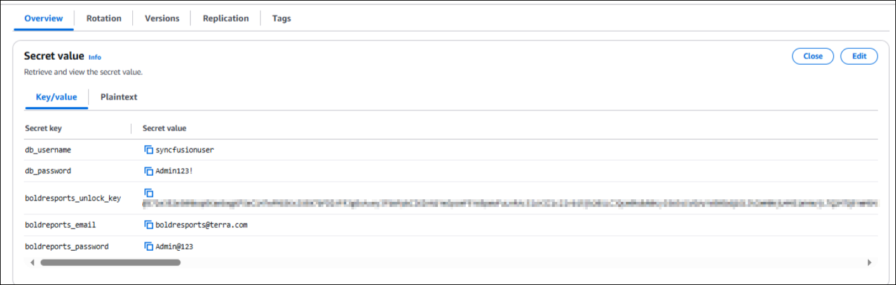

# Deploy Bold BI Using Terraform on AWS ECS

This guide explains how to deploy Bold BI using a Terraform script. The script automates the creation of all necessary AWS resources and the deployment of Bold BI. Once the deployment is complete, you can copy and paste the APP_URL into your browser to start evaluating Bold BI.

---

## Prerequisites

Before proceeding, ensure the following tools and resources are installed and available:

1. **Terraform CLI**  
   Install Terraform from the official guide: [Terraform Installation Guide](https://developer.hashicorp.com/terraform/tutorials/aws-get-started/install-cli)
2. **AWS Account with Required Privileges**  
   Ensure your AWS account has the necessary permissions defined in the [Policy.json](./policy.json) file.

---

## Overview of the Script

The Terraform script creates the following resources:

- **Application Load Balancer**
- **ECS Cluster** (with EC2/Fargate Launch Type)
- **EFS Storage**
- **RDS PostgreSQL Server**
- **Task Definitions** for Bold BI Services
- **Security Group, VPC, Internet Gateway, and Route Table**
- **Domain Mapping Entry** on Route 53

---

## Deployment Steps

### Step 1: Clone the Terraform Scripts Repository
Clone the Terraform scripts repository using the following command:

```sh
 git clone https://github.com/boldbi/boldbi-terraform-scripts.git
```

### Step 2: Navigate to the Terraform Scripts Directory
```sh
cd boldbi-terraform-scripts/aws-ecs
```


### Step 3: Set Environment Variables
Add the following environment variables either as a [local system](https://chlee.co/how-to-setup-environment-variables-for-windows-mac-and-linux/) variable or in [AWS Secrets Manager](https://docs.aws.amazon.com/secretsmanager/latest/userguide/create_secret.html) as shown below:

| Variable Name               | Description                                       |
|-----------------------------|---------------------------------------------------|
| AWS_ACCESS_KEY_ID          | AWS access key for authentication                |
| AWS_SECRET_ACCESS_KEY      | AWS secret key for authentication                |
| TF_VAR_db_username         | Database username                                |
| TF_VAR_db_password         | Database password                                |
| TF_VAR_boldbi_username     | Bold BI admin username                           |
| TF_VAR_boldbi_usr_password | Bold BI admin password                           |
| TF_VAR_bold_unlock_key     | Unlock key for Bold BI                           |
| TF_VAR_route53_zone_id     | AWS Route 53 Zone ID (if applicable)             |
| TF_VAR_acm_certificate_arn | AWS ACM Certificate for SSL configuration        |

Variables after setting in system variables:


Variables after setting in AWS Secrets Manager:


**Note:** If you are using AWS Secrets Manager, you need to specify the AWS secret ARN in the `variable.tfvar` file as shown below.


If you need to change any infrastructure or application-level settings, refer to the `variable.tfvar` file.

If you do not set the secrets in either location, Terraform will prompt you for the values during execution.

### Step 4: Initialize Terraform
Open PowerShell or Terminal from the `boldbi-terraform-scripts/aws-ecs` directory and run the following command:
```sh
terraform init
```


### Step 5: Validate the Terraform Script
Run the following command to validate the script before applying:
```sh
terraform validate
```


### Step 6: Apply the Terraform Script
Execute the following command to apply the Terraform script. When prompted, type "yes" to approve the resource creation.
```sh
terraform apply
```


After seeing the following message, you can access Bold BI in your browser:


Please wait until the startup process completes and avoid opening the URL in multiple tabs. The initial startup may take some time. Once the startup configuration is complete, Bold BI will be ready for use.


## Destroy Bold BI and Resources
To destroy Bold BI and all associated resources, run the following command from the same directory. When prompted, type "yes" to confirm the deletion.
```sh
terraform destroy
```
