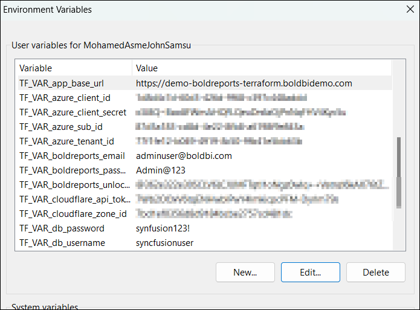
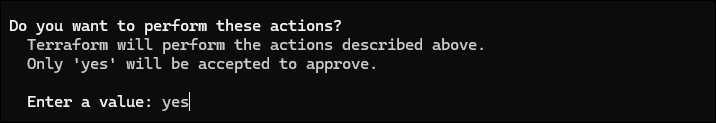

# Deploy Bold Reports Using Terraform on AKS Cluster

This guide explains how to deploy Bold Reports using a Terraform script. The script automates the creation of all necessary Azure resources and the deployment of Bold Reports. Once the deployment is complete, you can copy and paste the APP_URL into your browser to start evaluating Bold Reports.

---

## Prerequisites

Before proceeding, ensure the following tools and resources are installed and available:

1. **Terraform CLI**  
   Install Terraform from the official guide: [Terraform Installation Guide](https://developer.hashicorp.com/terraform/tutorials/aws-get-started/install-cli)
2. [Azure Subscription](https://azure.microsoft.com/en-us/pricing/purchase-options/azure-account) with An [Azure Application Registry](https://learn.microsoft.com/en-us/entra/identity-platform/howto-create-service-principal-portal)
   - Client ID
   - Client Secret
   - Tenant ID
   - Subscription ID

---

## Overview of the Script

The Terraform script creates the following resources:

1. **Resource Group** – A dedicated group for managing all resources.
2. **Virtual Network (VNET) and Subnets** – For network configuration.
3. **Azure Kubernetes Service (AKS) Cluster** – The core infrastructure for hosting Bold Reports.
4. **PostgreSQL Server** – The database for storing Bold Reports configurations and data.
5. **Storage Account with NFS** – To store Required application data.

---

## Deployment Steps

### Step 1: Clone the Terraform Scripts Repository
Clone the Terraform scripts repository using the following command:

```sh
 git clone https://github.com/boldreports/bold-reports-terraform-scripts.git
```

### Step 2: Navigate to the Terraform Scripts Directory
```sh
cd bold-reports-terraform-scripts/azure-aks
```

### Step 3: Set Environment Variables
Set up the following environment variables on your [local system](https://chlee.co/how-to-setup-environment-variables-for-windows-mac-and-linux/) as shown below:

### 🔹 Provider Environment Variables

| Variable Name               | Description                                       |
|-----------------------------|---------------------------------------------------|
| TF_VAR_azure_client_id *      | Azure Client ID for authentication                |
| TF_VAR_azure_client_secret * | Azure Client secret for authentication            |
| TF_VAR_azure_sub_id *        | Azure Subscription ID for authentication          |
| TF_VAR_azure_tenant_id *     | Azure Tenant ID for authentication                |

### 🔹 Application Environment Variables
| Variable Name               | Description                                       |
|-----------------------------|---------------------------------------------------|
| TF_VAR_db_username *         | **Database username** <br> - db username must only contain characters and numbers.<br> - db username cannot be 'azure_superuser', 'azure_pg_admin', 'admin', 'administrator', 'root', 'guest', 'public' or start with 'pg_'.                             |
| TF_VAR_db_password *         | **Database password** <br> - Your password must be at least 8 characters and at most 128 characters.<br> - Your password must contain characters from three of the following categories<br> - English uppercase letters, English lowercase letters, numbers (0-9), and non-alphanumeric characters (!, $, #, %, etc.).<br> - Your password cannot contain all or part of the login name. Part of a login name is defined as three or more consecutive alphanumeric characters.                                 |
| TF_VAR_app_base_url         | The base URL for the Bold Reports application (e.g., https://example.com).<br>If left empty, Azure DNS with randomly generated characters will be used for application hosting(e.g., http://abcd.eastus2.cloudapp.azure.com).<p><br> **Note:-**  If app_base_url is left empty, you must install Azure CLI on your machine for Azure DNS mapping.[Azure CLI Installation Guide](https://learn.microsoft.com/en-us/cli/azure/install-azure-cli)                                                |
| TF_VAR_cloudflare_api_token | Cloudflare API Token for DNS mapping on cloudflare|
| TF_VAR_cloudflare_zone_id   | Cloudflare zone ID for DNS mapping on cloudflare  |
| TF_VAR_tls_certificate_path | For apply SSL creatificate on AKS cluster <br>Example <br>**windows**<br>D:\\\SSL\\\test\\\domain.crt<br>**Linux**<br>/home/adminuser/ssl/test/domain.crt        | 
| TF_VAR_tls_key_path | For apply SSL private key on AKS cluster <br>Example <br>**windows**<br>D:\\\SSL\\\test\\\domain.key<br>**Linux**<br>/home/adminuser/ssl/test/domain.key         | 

### 🔄 Notes

🌟 `*` marked variables are mandatory field .  
🌟 If any environment variable is not set, Terraform will prompt you to enter it during execution.  
🌟 Please open a new terminal or PowerShell session after setting the environment variable in the system to ensure the updated value is recognized.

Variables after setting in system variables:



If you need to change any infrastructure or application-level settings, refer to the `terraform.tfvars` file.
### Step 4: Initialize Terraform
Open PowerShell or Terminal from the `bold-reports-terraform-scripts/azure-aks` directory and run the following command:
```sh
terraform init
```


### Step 5: Validate the Terraform Script
Run the following command to validate the script before applying:
```sh
terraform validate
```


### Step 6: Apply the Terraform Script
Execute the following command to apply the Terraform script. When prompted, type "yes" to approve the resource creation.
```sh
terraform apply
```


After seeing the following message, you can access Bold Reports in your browser:

Please wait until the startup process completes and avoid opening the URL in multiple tabs. The initial startup may take some time. Once the startup configuration is complete, Bold Reports will be ready for use.

## Destroy Bold Reports and Resources
To destroy Bold Reports and all associated resources, run the following command from the same directory. When prompted, type "yes" to confirm the deletion.
```sh
terraform destroy
```
