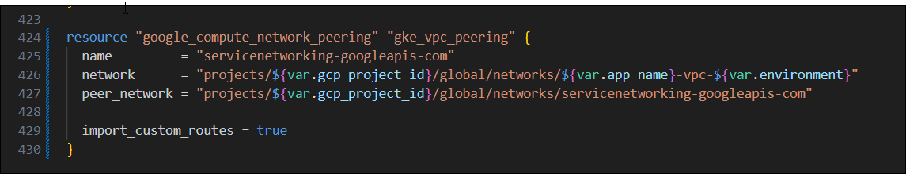

# Deploy Bold BI Using Terraform on GKE Cluster

This guide explains how to deploy Bold BI using a Terraform script. The script automates the creation of all necessary GCP resources and the deployment of Bold BI. Once the deployment is complete, you can copy and paste the `APP_URL` into your browser to start evaluating Bold BI.

---

## Prerequisites

Before proceeding, ensure the following tools and resources are installed and available:

1. **Terraform CLI**  
   Install Terraform from the official guide: [Terraform Installation Guide](https://developer.hashicorp.com/terraform/tutorials/aws-get-started/install-cli)
2. **[Google Cloud Project](https://developers.google.com/workspace/guides/create-project) with a [Service Account](https://learn.microsoft.com/en-us/entra/identity-platform/howto-create-service-principal-portal)**  
   Ensure you carefully review the Terraform script and provide the required permissions to the service account. Download the service account JSON key file for use in the Terraform script.

---

## Overview of the Script

The major resources created by the Terraform script:

1. **Virtual Network (VPC) and Subnets** – For network configuration.
2. **Google Kubernetes Engine (GKE) Cluster** – The core infrastructure for hosting Bold BI.
3. **PostgreSQL Server** – The database for storing Bold BI configurations and data.
4. **Filestore** – To store required application data.

---

## Deployment Steps

### Step 1: Clone the Terraform Scripts Repository
Clone the Terraform scripts repository using the following command:

```sh
 git clone https://github.com/boldbi/boldbi-terraform-scripts.git
```

### Step 2: Navigate to the Terraform Scripts Directory

```sh
cd boldbi-terraform-scripts/gcp-gke
```


### Step 3: Set Environment Variables
To authenticate Terraform with your Google Cloud account, add the file path of the service account JSON key file as an environment variable to your [local system](https://chlee.co/how-to-setup-environment-variables-for-windows-mac-and-linux/).

| Variable Name                   | Required | Description                                      |
|----------------------------------|----------|--------------------------------------------------|
| TF_VAR_google_credentials_json | Yes      | Google project authentication.                  |

Additionally, you need to add other required environment variables as local [system variables](https://chlee.co/how-to-setup-environment-variables-for-windows-mac-and-linux/).

| system variable Name         | Required | Description                                       |
|------------------------------|----------|---------------------------------------------------|
| TF_VAR_db_username            | Yes     | **Database username** <br> - db username must only contain characters and numbers.<br> - db username cannot be 'admin', 'administrator', 'root', 'guest', 'public' or start with 'pg_'.
| TF_VAR_db_password           | Yes      | **Database password** <br> - Your password must be at least 8 characters and at most 128 characters.<br> - Your password must contain characters from three of the following categories<br> - English uppercase letters, English lowercase letters, numbers (0-9), and non-alphanumeric characters (!, $, #, %, etc.).<br> - Your password cannot contain all or part of the login name. Part of a login name is defined as three or more consecutive alphanumeric characters.                                 |
| TF_VAR_boldbi_email          | Yes      | Bold BI admin Email                               |
| TF_VAR_boldbi_password       | Yes      | **Bold BI admin password**<br> - Your password must be at least 8 characters and at most 128 characters.<br> - Your password must contain characters from three of the following categories<br> - English uppercase letters, English lowercase letters, numbers (0-9), and non-alphanumeric characters (!, $, #, %, etc.)|
| TF_VAR_boldbi_unlock_key     | Yes      | Unlock key for Bold BI                            |
| TF_VAR_app_base_url          | Yes      | The app_base_url variable is used as the base URL for the Bold BI application.(e.g., https://example.com).<br> It is mandatory and will be mapped to the Nginx server's IP using a Cloudflare domain, as configured by the Terraform script.<br>                                          |
| TF_VAR_cloudflare_api_token  | Yes      | Cloudflare API Token for DNS mapping on cloudflare|
| TF_VAR_cloudflare_zone_id    | Yes      | Cloudflare zone ID for DNS mapping on cloudflare  |
| TF_VAR_tls_certificate_path  | Yes      |For apply SSL creatificate on AKS cluster <br>Example <br>**windows**<br>D:\\\SSL\\\test\\\domain.crt<br>**Linux**<br>/home/adminuser/ssl/test/domain.crt        | 
| TF_VAR_tls_key_path          | Yes      | For apply SSL private key on AKS cluster <br>Example <br>**windows**<br>D:\\\SSL\\\test\\\domain.key<br>**Linux**<br>/home/adminuser/ssl/test/domain.key         | 

Variables after setting in system variables:


If you need to change any infrastructure or application-level settings, refer to the `terraform.tfvars` file.

### Step 4: Initialize Terraform
Open PowerShell or Terminal from the `boldbi-terraform-scripts/gcp-gke` directory and run the following command:
```sh
terraform init
```


### Step 5: Validate the Terraform Script
Run the following command to validate the script before applying:
```sh
terraform validate
```


### Step 6: Apply the Terraform Script
Execute the following command to apply the Terraform script. When prompted, type "yes" to approve the resource creation.
```sh
terraform apply
```


After seeing the following message, you can access Bold BI in your browser:


Please wait until the startup process completes and avoid opening the URL in multiple tabs. The initial startup may take some time. Once the startup configuration is complete, Bold BI will be ready for use.


## Destroy Bold BI and Resources
To destroy Bold BI and all associated resources, run the following command from the same directory. When prompted, type "yes" to confirm the deletion.

1. Uncomment the `google_compute_network_peering` resource in the `main.tf` file as shown below.

   

2. Import the google_compute_network_peering resource into Terraform using the commands below.

   ```sh
   terraform import google_compute_network_peering.gke_vpc_peering <gcp_project_id>/<app_name>-vpc-<environment>/servicenetworking-googleapis-com
   ```
3. Destroy the google_compute_network_peering resource using the command below to avoid issues in complete resource destruction.
   ```sh
   terraform destroy -target google_compute_network_peering.gke_vpc_peering -auto-approve
   ```

4. Use the terraform destroy command to delete all resources created by Terraform.
   ```sh
   terraform destroy
   ```
   
